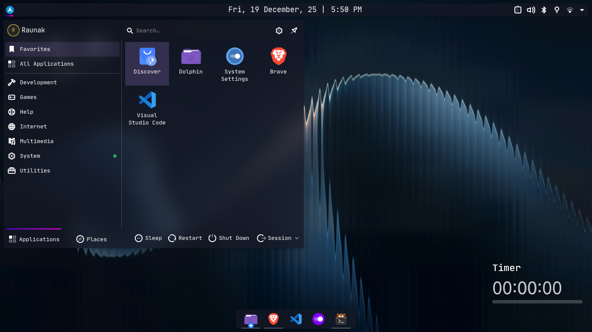
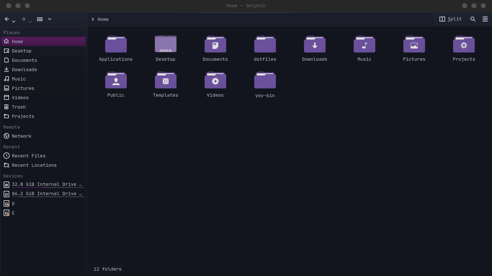

### Screenshots






# 🛠️ Arch Linux + KDE Dotfiles

A clean, minimal, productivity-focused Arch Linux + KDE Plasma setup for developers.

This repository documents:
- How to set up a fresh Arch + KDE system
- Essential tools for development
- Personal shell dotfiles (Zsh & Bash)

## ✨ What You Get

- KDE Plasma (stable desktop environment)
- Zsh + Oh My Zsh (better shell experience)
- Powerlevel10k (fast, informative prompt)
- Node.js via NVM (node, npm, pnpm)
- Brave Browser
- VS Code (binary build)
- yay (AUR helper)

## How To Install

### Font
- Install and extract zip folder: JetBrainsMono.zip

### Icons
- Install: https://store.kde.org/p/1279924/

### Colors
- Download File: kde/colors/SweetKdeRaunak.colors
- Put it in this folder: `~/.local/share/color-schemes/`

### Plasma Style
1. Download File: kde/plasma/Sweet-plasma.tar.gz
2. Extract inside this folder: `~/.local/share/plasma/desktoptheme/`

### Window Decorations
1. Download File: kde/aurorae/MacVentura-Dark-Decoration.tar.gz
2. Extract inside this folder: `~/.local/share/aurorae/themes/`

## 🚀 Quick start (assumptions)

- You already have Arch Linux installed
- KDE Plasma is available / selected
- You have a working network connection

Follow the steps below to set up a minimal developer-friendly KDE system.

---

### 1. Update the system

Keep your system current before installing new packages:

```bash
sudo pacman -Syu
```

Reboot if the kernel or Plasma packages were updated.

---

### 2. Install essential tools

Install packages used for building, networking, and development:

```bash
sudo pacman -S --needed \
  git base-devel curl wget zsh NetworkManager
```

Enable networking:

```bash
sudo systemctl enable --now NetworkManager
```

---

### 3. Zsh & Oh My Zsh

Set Zsh as your login shell:

```bash
chsh -s /bin/zsh
```

Install Oh My Zsh:

```bash
sh -c "$(curl -fsSL https://raw.githubusercontent.com/ohmyzsh/ohmyzsh/master/tools/install.sh)"
```

Reload your shell after installation:

```bash
source ~/.zshrc
```

---

### 4. Powerlevel10k (optional)

Install the prompt theme:

```bash
git clone --depth=1 https://github.com/romkatv/powerlevel10k.git \
  ${ZSH_CUSTOM:-$HOME/.oh-my-zsh/custom}/themes/powerlevel10k
```

Then set in `~/.zshrc`:

```ini
ZSH_THEME="powerlevel10k/powerlevel10k"
```

Configure after reloading Zsh:

```bash
source ~/.zshrc
p10k configure
```

---

## 5. Node.js via NVM (recommended)

Install NVM and use it to manage Node versions:

```bash
curl -o- https://raw.githubusercontent.com/nvm-sh/nvm/v0.39.7/install.sh | bash

source ~/.zshrc

nvm install --lts

npm install -g pnpm
```

Verify installations:

```bash
node -v && npm -v && pnpm -v
```

---

### 6. Apply dotfiles using install.sh

This repository includes a ready-to-use installer script:

dotfiles/scripts/install.sh

**Features**:

- Clone and build **yay** to install AUR Package

- Backup and link shell configs (.zshrc, .bashrc)

- Copy KDE Plasma themes & icons
- Optionally install core applications (VS Code, Brave, Kitty)

To Run the installer Follow the prompts in the script:

```
cd ~/dotfiles

chmod +x scripts/install.sh

./scripts/install.sh
```

---

### 7. Kitty terminal configuration

Kitty stores user configuration under `~/.config/kitty/`. This repository includes an example config at `kitty/kitty.conf` that you can link into your home directory.

```
kitty/
└── kitty.conf
```

Steps to install the config:

```bash
# create the config directory (if needed) and symlink the packaged config
git clone https://github.com/<raunak-dubey>/dotfiles.git ~/dotfiles
cd ~/dotfiles

mkdir -p "$HOME/.config/kitty"

ln -sf "$HOME/dotfiles/kitty/kitty.conf" "$HOME/.config/kitty/kitty.conf"
```

Apply changes:

```bash
# If a Kitty instance is running, reload its config:
kitty @ reload-config
# If that does not apply the changes, restart Kitty (close and re-open the app)
```

**Tip:** If your config changes don't take effect, ensure you are modifying the file pointed to by the symlink and that Kitty is running under the same user account.